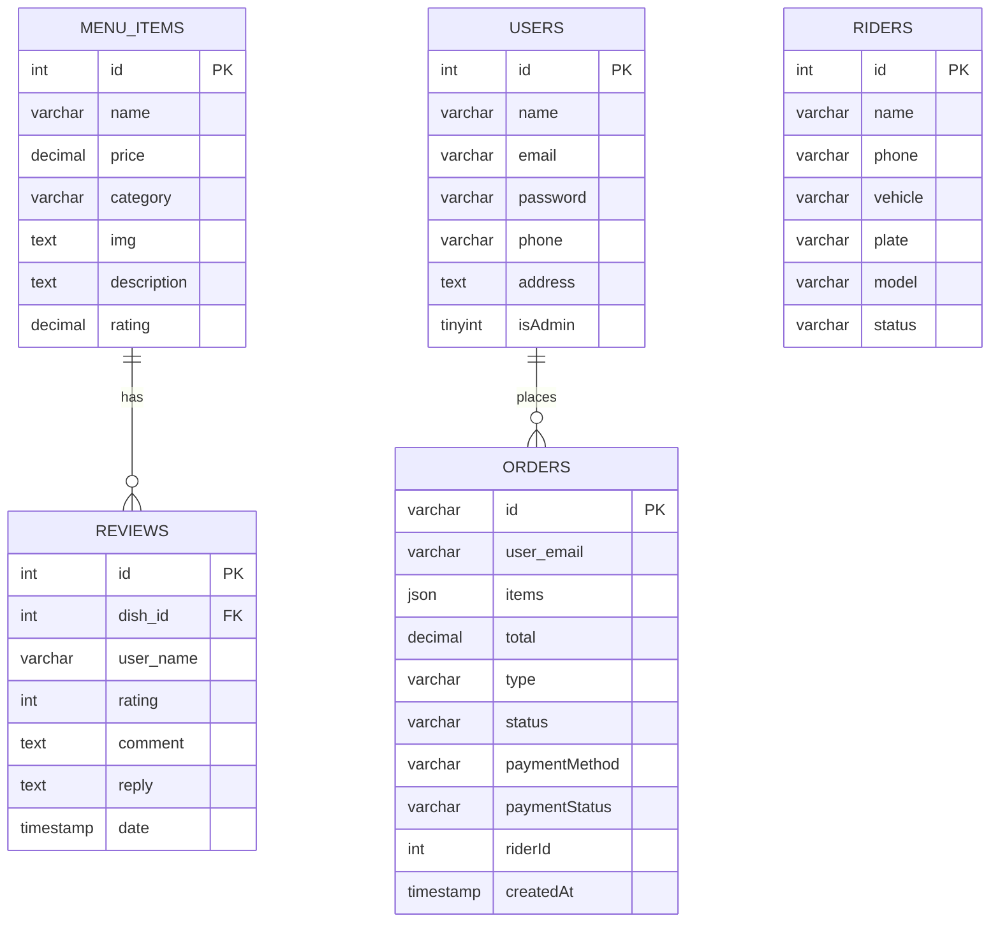

# SIA Project — Complete Documentation

This document consolidates detailed developer and operator documentation for the SIA online ordering system (frontend + backend). It's designed to be uploaded to Google Docs or used directly from the repository.

Contents
- Overview
- Architecture & ERD
- Quickstart (development)
- Environment variables
- Database schema & examples
- API reference (detailed)
- Backend internals
- Frontend internals
- Seeding & data maintenance
- Deployment & production checklist
- Troubleshooting & FAQ
- Appendix: sample requests & responses

---

## Overview

SIA is a small online food ordering application composed of:

- Frontend: React (Vite) app located in the `frontend/` folder.
- Backend: Node.js + Express app located in the `backend/` folder, using MySQL via `mysql2/promise` (`backend/db.js`).
- Database: MySQL with tables for `menu_items`, `reviews`, `users`, `orders`, and `riders`.

Primary UX flows
- Customers browse the menu and open dish details.
- Authenticated customers can submit star ratings and textual reviews.
- Reviews are stored in `reviews` and the backend updates the aggregated `menu_items.rating` immediately after insert.

---

## Architecture & ERD

High-level components

- Client (React): UI, contexts for auth/menu/cart/order
- API (Express): REST endpoints for auth, menu, orders, reviews, riders
- DB (MySQL): persistent storage

Mermaid ER diagram (openable in compatible renderers):



---

## Quickstart (development)

Prerequisites
- Node.js 18+ and npm
- MySQL server
- PowerShell or a POSIX shell

1) Backend setup (Terminal A)

```powershell
cd backend
npm install
# create a .env file (see next section)
node seed.js         # create menu_items
node seed_system.js  # create sample users, orders, reviews and update averages
npm run dev          # start server with nodemon (auto-reload)
# (or) node server.js
```

2) Frontend setup (Terminal B)

```powershell
cd frontend
npm install
npm run dev
```

Open the Vite URL (usually http://localhost:5173). Backend APIs default to http://localhost:5000.

---

## Environment variables

Place a `.env` file in the `backend/` directory with:

```
DB_HOST=127.0.0.1
DB_USER=root
DB_PASS=your_password
DB_NAME=sia_ordering
PORT=5000
```

Adjust for your environment. Do not commit `.env` to source control.

---

## Database schema & examples

DDL (create tables used by the application):

```sql
CREATE TABLE IF NOT EXISTS menu_items (
  id INT AUTO_INCREMENT PRIMARY KEY,
  name VARCHAR(255) NOT NULL,
  price DECIMAL(10,2) NOT NULL,
  category VARCHAR(100),
  img TEXT,
  description TEXT,
  rating DECIMAL(3,2) DEFAULT 0.0
);

CREATE TABLE IF NOT EXISTS reviews (
  id INT AUTO_INCREMENT PRIMARY KEY,
  dish_id INT NOT NULL,
  user_name VARCHAR(255),
  rating INT NOT NULL,
  comment TEXT,
  reply TEXT,
  date TIMESTAMP DEFAULT CURRENT_TIMESTAMP,
  FOREIGN KEY (dish_id) REFERENCES menu_items(id) ON DELETE CASCADE
);

CREATE TABLE IF NOT EXISTS users (
  id INT AUTO_INCREMENT PRIMARY KEY,
  name VARCHAR(255),
  email VARCHAR(255) UNIQUE,
  password VARCHAR(255),
  phone VARCHAR(50),
  address TEXT,
  isAdmin TINYINT(1) DEFAULT 0
);

CREATE TABLE IF NOT EXISTS orders (
  id VARCHAR(50) PRIMARY KEY,
  user_email VARCHAR(255),
  items JSON,
  total DECIMAL(10,2),
  type VARCHAR(50),
  status VARCHAR(50),
  paymentMethod VARCHAR(50),
  paymentStatus VARCHAR(50),
  riderId INT,
  createdAt TIMESTAMP DEFAULT CURRENT_TIMESTAMP
);

CREATE TABLE IF NOT EXISTS riders (
  id INT AUTO_INCREMENT PRIMARY KEY,
  name VARCHAR(255),
  phone VARCHAR(50),
  vehicle VARCHAR(100),
  plate VARCHAR(50),
  model VARCHAR(100),
  status VARCHAR(50) DEFAULT 'Available'
);
```

Notes and queries
- To view existing table definitions: run `DESCRIBE <table>` in MySQL or use the repo scripts `backend/check_schema.js` and `backend/check_full_schema.js`.
- `menu_items.rating` is stored as the current averaged rating (decimal). The backend updates this value after each review insert using `AVG(rating)` over the `reviews` table.

Example: recompute one item's rating

```sql
SELECT AVG(rating) as avgRating FROM reviews WHERE dish_id = 21;
UPDATE menu_items SET rating = <avgRating> WHERE id = 21;
```

---

## API Reference (detailed)

Base URL (development): `http://localhost:5000/api`

All endpoints expect and return JSON. Below are the primary endpoints with request/response examples.

### Auth

- POST `/api/login`
  - Body: `{ "email": "user@example.com", "password": "pass" }`
  - Success response: `200` user object (no password)

Example

```bash
curl -X POST http://localhost:5000/api/login \
  -H 'Content-Type: application/json' \
  -d '{"email":"juan@gmail.com","password":"P@$$w0rd"}'
```

### Signup

- POST `/api/signup`
  - Body: `{ name, email, password, phone, address }` — creates a user

### Menu

- GET `/api/menu`
  - Returns: array of menu items, each including a `reviews` array.

Sample menu item response (trimmed):

```json
{
  "id": 21,
  "name": "Classic Chicken Adobo",
  "price": 245.00,
  "category": "Mains",
  "img": "https://...",
  "description": "...",
  "rating": 4.67,
  "reviews": [ { "id": 1, "dish_id":21, "user_name":"Juan", "rating":5, "comment":"Great" } ]
}
```

- POST `/api/menu`
  - Create a menu item — body: `{ name, price, category, img, description }`

### Reviews

- POST `/api/reviews`
  - Body: `{ dish_id, user_name, rating, comment }`
  - Behavior: Inserts a review row, then the backend recalculates the dish average and persists it to `menu_items.rating`.
  - Response: `201` with inserted review ID and `avgRating` when successful.

Sample request

```bash
curl -X POST http://localhost:5000/api/reviews \
  -H 'Content-Type: application/json' \
  -d '{"dish_id":21,"user_name":"juan@gmail.com","rating":4,"comment":"Nice!"}'
```

Sample successful response

```json
{
  "id": 123,
  "dish_id": 21,
  "user_name": "juan@gmail.com",
  "rating": 4,
  "comment": "Nice!",
  "avgRating": 4.57
}
```

If the server inserted the review but failed to update the aggregated rating, the response will contain a `warning` field.

- PUT `/api/reviews/:id/reply`
  - Body: `{ reply }` — used by admin to post a reply to a review.

### Orders

- POST `/api/orders`
  - Body: `{ id, user, items, total, type, paymentMethod, paymentStatus }`
  - `items` is expected to be JSON-serializable (the server stores as stringified JSON in DB).

- GET `/api/orders` (admin) — returns orders joined with user details.

---

## Backend internals

Key files
- `backend/server.js` — express routes and handlers (auth, menu, orders, reviews, riders).
- `backend/db.js` — exports a `mysql2/promise` pool using `.env` variables.
- `backend/seed.js`, `backend/seed_system.js`, `backend/add_extra_reviews.js` — helper seed scripts.

Important logic
- Review insertion flow (simplified):

1. Insert review into `reviews` table.
2. Query `SELECT AVG(rating) FROM reviews WHERE dish_id = ?`.
3. `UPDATE menu_items SET rating = ? WHERE id = ?`.

This ensures the frontend sees the updated average next time it requests the menu.

Error handling
- Most endpoints return `500` with `{ error: <message> }` on unexpected DB errors. For production, consider adding structured logs and enhanced error codes.

Security notes
- Seed passwords are plaintext — replace with bcrypt hashed passwords and implement secure authentication (JWT or session-based) for production.

---

## Frontend internals

Main folders
- `frontend/src/components` — `FoodDetailsModal.jsx`, `CartSidebar.jsx`, `Navbar.jsx`, `Footer.jsx` etc.
- `frontend/src/context` — `MenuContext.jsx`, `AuthContext.jsx`, `CartContext.jsx`, `OrderContext.jsx`.

Key flows
- `MenuContext` fetches menu (`GET /api/menu`) and provides `addReview()` which calls `POST /api/reviews` and refreshes the menu via `fetchMenu()`.
- `FoodDetailsModal` handles the star UI and comment input, validates rating selection, then calls `addReview()`.

UX notes
- After submitting a review the UI resets the input and relies on the refreshed `menuItems` to reflect the updated `rating` value.

---

## Seeding & data maintenance

- `node seed.js` — populates `menu_items` with sample dishes.
- `node seed_system.js` — inserts sample users, orders and reviews, then recomputes menu item averages.
- `node add_extra_reviews.js` — helper to add more reviews in bulk and recompute averages.

If you make manual changes to `reviews`, re-run the AVG recomputation logic or run the helper script to resync `menu_items.rating`.

---

## Deployment & production checklist

Minimal production checklist

1. Use hashed passwords (bcrypt) and secure authentication (JWT or session with same-site cookies).
2. Move secrets to a secure store (Azure Key Vault, AWS Secrets Manager, or environment variables on CI/CD runner).
3. Run the backend behind a process manager (PM2, systemd) or in containers managed by Kubernetes / container service.
4. Use TLS (HTTPS) for frontend and backend. Put backend behind a reverse proxy (Nginx) or API Gateway.
5. Harden CORS policy to only allow known frontend origins.
6. Add request validation and rate limiting (express-rate-limit) on sensitive endpoints.
7. Add logging/monitoring (winston, pino, AppInsights, or DataDog).
8. Backup the database regularly and enable automated migrations.

Docker Compose (example) — local production-like environment

```yaml
version: '3.8'
services:
  db:
    image: mysql:8.0
    environment:
      MYSQL_ROOT_PASSWORD: example
      MYSQL_DATABASE: sia_ordering
    ports:
      - '3306:3306'
    volumes:
      - db-data:/var/lib/mysql

  backend:
    build: ./backend
    environment:
      DB_HOST: db
      DB_USER: root
      DB_PASS: example
      DB_NAME: sia_ordering
      PORT: 5000
    ports:
      - '5000:5000'
    depends_on:
      - db

  frontend:
    build: ./frontend
    ports:
      - '5173:5173'
    depends_on:
      - backend

volumes:
  db-data:
```

Note: `backend` and `frontend` images would require Dockerfiles; for quick local development prefer running `npm run dev`.

---

## Troubleshooting & FAQ

Q: Submitted reviews don't change the displayed rating.

A: Confirm the backend is running the updated `POST /api/reviews` handler that recalculates AVG and updates `menu_items.rating`. Restart the backend if you recently patched `server.js`.

Q: `GET /api/menu` returns no reviews.

A: Check `reviews` table content and ensure the `dish_id` values match `menu_items.id`. Run `node seed_system.js` to reseed sample data.

Q: DB connection refused.

A: Verify `.env` values, confirm MySQL is reachable, and check for firewall rules. Use `mysql -u <user> -p -h <host>` to test connectivity.

Q: How to re-sync all menu ratings after manual updates?

A: Run the recompute script pattern shown in `backend/add_extra_reviews.js` or run the `seed_system.js` which also updates averages.

---

## Appendix — Sample requests & responses

1) Submit a review (curl)

```bash
curl -X POST http://localhost:5000/api/reviews \
  -H 'Content-Type: application/json' \
  -d '{"dish_id":21,"user_name":"juan@gmail.com","rating":4,"comment":"Nice!"}'
```

Response

```json
{
  "id": 123,
  "dish_id": 21,
  "user_name": "juan@gmail.com",
  "rating": 4,
  "comment": "Nice!",
  "avgRating": 4.57
}
```

2) Get the menu

```bash
curl http://localhost:5000/api/menu
```

Response (one item)

```json
[
  {
    "id": 21,
    "name": "Classic Chicken Adobo",
    "price": 245,
    "category": "Mains",
    "img": "https://...",
    "description": "...",
    "rating": 4.57,
    "reviews": [ /* array of review objects */ ]
  }
]
```

---

## Convert this document to Google Docs (gdox)

Option A — Pandoc (recommended):

```powershell
choco install pandoc
pandoc docs/SIA-Project-Full-Documentation.md -o SIA-Project-Documentation.docx
```

Upload the produced DOCX to Google Drive and open it with Google Docs.

Option B — copy & paste: open the Markdown file, copy content, paste into a blank Google Doc, then adjust code block formatting.

---

## Next steps & how I can help

- I can convert this Markdown to DOCX and add it to the repo.
- I can generate an ERD image file, or add a PDF export.
- I can create a deployment `Dockerfile` and `docker-compose.yml` that builds and runs both services.

Tell me which of the above you'd like me to do next.
